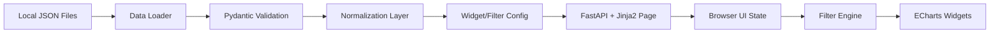

# Product Dashboard Architecture

Связанный документ: [[Product-dashboard]]

## 1. Цель документа

Этот документ фиксирует рекомендуемую архитектуру и технологический стек для первой версии продуктового дашборда с учетом текущих ограничений:

- локальный запуск на `localhost`
- источник данных - локальные `JSON`-файлы
- без внешнего `API`
- без базы данных
- с приоритетом на гибкость дизайна
- с приоритетом на многоуровневые фильтры
- с основной реализацией на Python

## 2. Короткий вывод

### Рекомендуемый стек

- `FastAPI` - локальный web-сервер и точка входа
- `Jinja2` - шаблоны страниц и HTML-каркас
- `Alpine.js` - легковесное состояние UI и зависимые фильтры
- `Apache ECharts` - рендер графиков
- `Pydantic v2` - валидация `JSON`-данных и конфигов
- `uv` - управление окружением и зависимостями
- `pytest` + `ruff` + `mypy` - базовый quality stack

### Почему именно это решение

- Оно оставляет максимальную свободу для будущего дизайна, потому что UI не заперт внутри готового dashboard-фреймворка.
- Оно хорошо подходит для многоуровневых фильтров, потому что фильтры можно описать конфигом и рендерить независимо от конкретного графика.
- Python остается главным языком проекта: сервер, валидация данных, конфигурация виджетов, агрегации и подготовка payload.
- Архитектура легко вырастает в следующую стадию, если позже понадобится автоматическая загрузка данных, `API` или хранилище.

## 3. Что я рекомендую не брать за основу

### `Streamlit`

Не рекомендую как основной стек для этого проекта.

Причины:

- слишком ограничивает произвольный дизайн и сложную адаптивную верстку
- быстро становится неудобным при кастомной логике зависимых фильтров
- хорошо подходит для быстрых внутренних прототипов, но хуже для управляемого UI-каркаса

### `Plotly Dash`

Это рабочий запасной вариант, если нужен почти полностью Python-only UI.

Почему не рекомендую как основной:

- по дизайну и компоновке он более ограничен, чем обычный HTML/CSS-слой
- при росте количества фильтров callback-граф начинает усложняться
- для будущего нестандартного визуала придется сильнее обходить ограничения фреймворка

> [!note]
> Если позже приоритет сместится в сторону "минимум фронтенда, максимум Python", то `Dash` можно рассматривать как fallback-стек. Но под текущий запрос на гибкий дизайн я бы стартовал не с него.

## 4. Целевой архитектурный подход

Для MVP рекомендую не делать отдельный внешний `API`-слой, а использовать локальное однопроцессное приложение со следующей логикой:

1. Python-приложение поднимает локальный сервер.
2. На старте приложение читает и валидирует локальные `JSON`-файлы.
3. Данные нормализуются во внутреннюю модель.
4. HTML-страница отдается локально вместе с конфигом виджетов и данными.
5. Фильтры и перерисовка графиков работают в браузере без постоянных запросов к серверу.

Такой подход лучше всего подходит под текущий объем и ограничения:

- не нужен `API`
- не нужна база данных
- фильтры работают быстро
- код остается модульным
- будущий переход к серверной агрегации остается возможным

## 5. Логическая схема



## 6. Принципы проектирования

### 6.1. Config-driven UI

Виджеты, фильтры, дефолтные значения, допустимые комбинации и шкалы осей должны задаваться конфигом, а не быть зашиты в шаблоны и `if/else`.

Это особенно важно для твоего кейса, потому что:

- у каждого графика свой набор фильтров
- часть фильтров зависит от выбора верхнего уровня
- позже легко добавятся новые сегменты, виджеты или правила отображения

### 6.2. Отделение данных от отображения

Нужно разделить:

- загрузку и валидацию данных
- фильтрацию и агрегацию
- подготовку series/payload для графиков
- отрисовку UI

Иначе при первом же усложнении фильтров код дашборда начнет расползаться.

### 6.3. Дизайн не должен зависеть от UI-фреймворка

Так как дизайн еще не определен, лучше не заходить в стек, который диктует layout и поведение экранов. Базовая верстка должна строиться на:

- `CSS Grid`
- `Flex`
- `CSS variables` для токенов
- собственных UI-примитивах

Это даст максимальную свободу, когда позже появятся требования к визуалу.

## 7. Рекомендуемый стек по слоям

| Слой | Технология | Зачем |
| --- | --- | --- |
| Server | `FastAPI` | локальный сервер, роутинг, статика, шаблоны |
| Templates | `Jinja2` | HTML-каркас и серверный рендер стартовой страницы |
| UI state | `Alpine.js` | состояние фильтров, зависимые селекты, простая реактивность |
| Charts | `Apache ECharts` | гибкие line/pie charts и хороший контроль над отображением |
| Data validation | `Pydantic v2` | схема данных, валидация конфигов и входных `JSON` |
| Data processing | стандартный Python, опционально `pandas` | фильтрация, агрегации, подготовка payload |
| Tooling | `uv` | окружение и зависимости |
| Quality | `pytest`, `ruff`, `mypy` | тесты, linting, типизация |

## 8. Как я предлагаю устроить фильтры

### 8.1. Общая идея

Фильтры должны быть не частью конкретных шаблонов, а самостоятельной конфигурационной моделью.

Для каждого виджета фиксируются:

- список фильтров
- порядок фильтров
- зависимости между фильтрами
- допустимые значения
- значения по умолчанию
- правило применения к данным

### 8.2. Типы фильтров

Для текущего MVP достаточно разделить фильтры на 2 типа:

- `independent` - не зависит от других фильтров
- `dependent` - доступные значения зависят от значения родительского фильтра

Примеры:

- `direction` - независимый фильтр
- `segment` - зависимый фильтр, зависит от `direction`
- `period` - независимый фильтр
- `sprint` - независимый фильтр

### 8.3. Почему это важно

Если зависимость фильтров описывать кодом прямо в UI, потом будет сложно:

- добавлять новые комбинации
- переиспользовать логику между графиками
- тестировать, какие состояния допустимы

Если же зависимость хранится в конфиге, UI просто читает текущую схему и строит нужные контролы.

### 8.4. Пример Python-конфига

```python
from pydantic import BaseModel
from typing import Literal


class FilterOption(BaseModel):
    value: str
    label: str


class FilterConfig(BaseModel):
    key: str
    kind: Literal["independent", "dependent"]
    depends_on: str | None = None
    default: str | None = None
    options: list[FilterOption] = []
    options_by_parent: dict[str, list[FilterOption]] = {}


class WidgetConfig(BaseModel):
    widget_id: str
    chart_type: Literal["line", "pie"]
    filters: list[FilterConfig]
```

Такой подход позволит хранить правила виджета отдельно от верстки и отдельно от данных.

## 9. Архитектура данных

### 9.1. Физическое хранение

Для MVP рекомендую хранить данные не в одном огромном файле, а в директории `data/`:

- `monthly_metrics.json`
- `source_distribution.json`
- `tickets.json`

Почему так лучше:

- проще обновлять по частям
- проще валидировать по отдельным схемам
- проще подключать будущую автоматизацию загрузки

### 9.2. Внутренний data flow

1. Loader читает `JSON`.
2. Validator приводит данные к typed-моделям.
3. Normalizer приводит поля к единому виду.
4. Aggregation layer готовит срезы для графиков.
5. UI получает уже нормализованный payload.

### 9.3. Где фильтровать данные

Для MVP рекомендую комбинированный подход:

- Python отвечает за загрузку, валидацию и нормализацию данных
- браузер отвечает за переключение фильтров и быструю перерисовку графиков

Это оптимально, потому что:

- объем данных сейчас небольшой
- не нужен сетевой roundtrip при каждом изменении фильтра
- UI ощущается быстрым
- логика сервера пока остается простой

## 10. Архитектура UI

### 10.1. Layout

Разметку страницы лучше строить через `CSS Grid`, потому что у тебя уже есть плиточная структура:

- первый ряд: 2 графика
- второй ряд: 1 широкий график
- третий ряд: 2 виджета

Это позволит позже гибко менять:

- пропорции колонок
- перестройку на tablet/mobile
- поведение карточек на узких экранах

### 10.2. UI-принципы для MVP

- каждый виджет - отдельная карточка-компонент
- у каждой карточки есть:
  - header
  - зона фильтров
  - контейнер графика
  - состояние `loading/error/empty`
- глобальный layout не должен знать деталей фильтров каждого виджета

### 10.3. Почему не стоит хардкодить фильтры прямо в HTML

Если фильтры разных графиков зашить вручную в шаблоны, то потом будет сложно:

- синхронизировать поведение
- поддерживать default-состояния
- переиспользовать одни и те же паттерны управления

Лучше рендерить фильтры по конфигу виджета и хранить текущее состояние в одном UI-store.

## 11. Рекомендуемая структура проекта

```text
product-dashboard/
  app/
    main.py
    settings.py
    routes/
      pages.py
    domain/
      enums.py
      models.py
    config/
      widgets.py
      filters.py
    services/
      data_loader.py
      validators.py
      normalizers.py
      filter_engine.py
      aggregations.py
      chart_payloads.py
    templates/
      dashboard.html
      components/
        widget_card.html
        filters.html
    static/
      css/
        dashboard.css
      js/
        dashboard.js
        charts.js
    data/
      monthly_metrics.json
      source_distribution.json
      tickets.json
  tests/
    test_filter_engine.py
    test_aggregations.py
    test_chart_payloads.py
  pyproject.toml
```

## 12. Нефункциональные ориентиры для первой версии

Для MVP рекомендую сразу заложить такие ориентиры:

- локальный старт приложения без внешних зависимостей
- понятная ошибка при невалидном `JSON`
- конфигурация виджетов без правок в нескольких местах одновременно
- время отклика UI при переключении фильтров - визуально мгновенное
- отсутствие жесткой привязки верстки к конкретной библиотеке компонентов

## 13. Технические решения, которые стоит принять сразу

### 13.1. Зафиксировать Python-версию

Рекомендация: `Python 3.12`.

### 13.2. Сразу ввести типизированные модели

Все входные данные и конфиги лучше валидировать через `Pydantic`, чтобы не собирать скрытые ошибки в фильтрах и комбинациях сегментов.

### 13.3. Сразу вынести конфиг виджетов отдельно

Это даст возможность позже менять:

- дефолты
- доступные фильтры
- шкалы осей
- подписи

без переписывания UI-кода.

## 14. Рекомендуемый стартовый план реализации

1. Поднять пустой локальный каркас на `FastAPI`.
2. Подключить базовый HTML-layout и плиточную сетку.
3. Описать `Pydantic`-модели входных данных.
4. Завести `widget config registry`.
5. Реализовать `filter engine` для зависимых фильтров.
6. Подключить `ECharts` и отрисовать один линейный график.
7. После этого масштабировать тот же паттерн на остальные виджеты.

## 15. Итоговая рекомендация

Если брать одно решение под текущие требования, я бы рекомендовал:

`FastAPI + Jinja2 + Alpine.js + Apache ECharts + Pydantic`

Почему:

- это лучший баланс между Python-реализацией и свободой будущего дизайна
- это удобнее для сложных фильтров, чем готовые Python dashboard-фреймворки
- это не требует лишней сервисной обвязки для локального MVP
- это даст нормальный фундамент для следующего шага, когда появятся требования к визуалу и автоматизации данных
